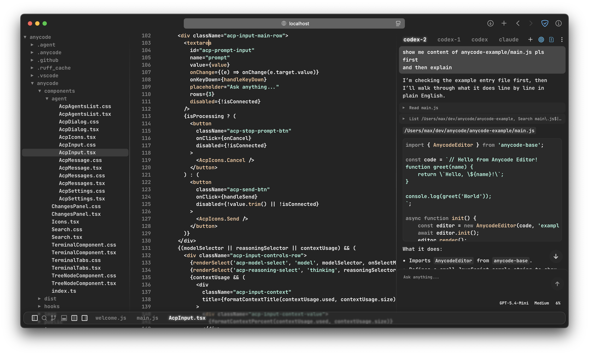
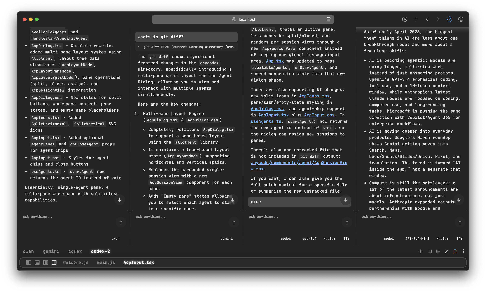
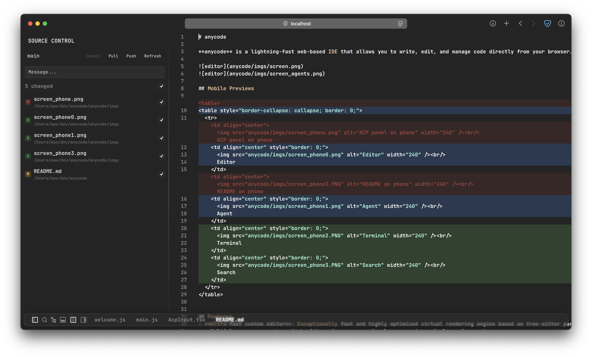
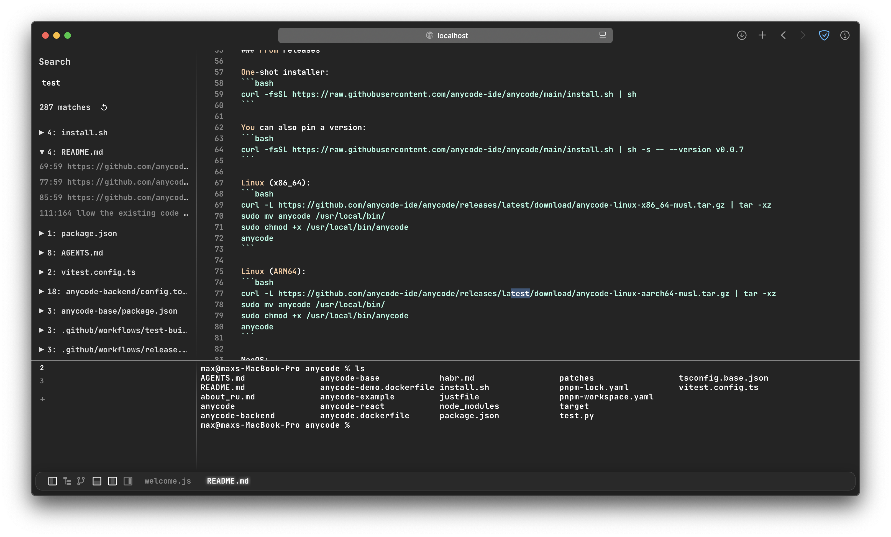
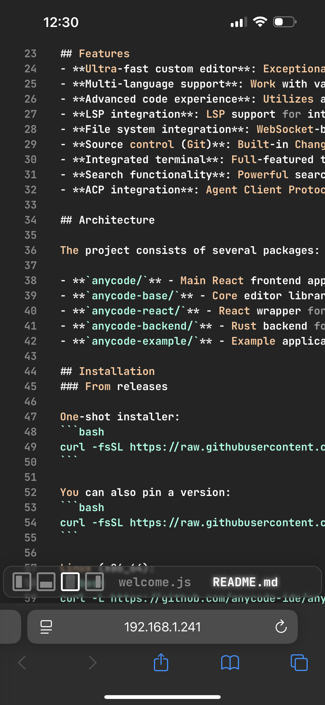
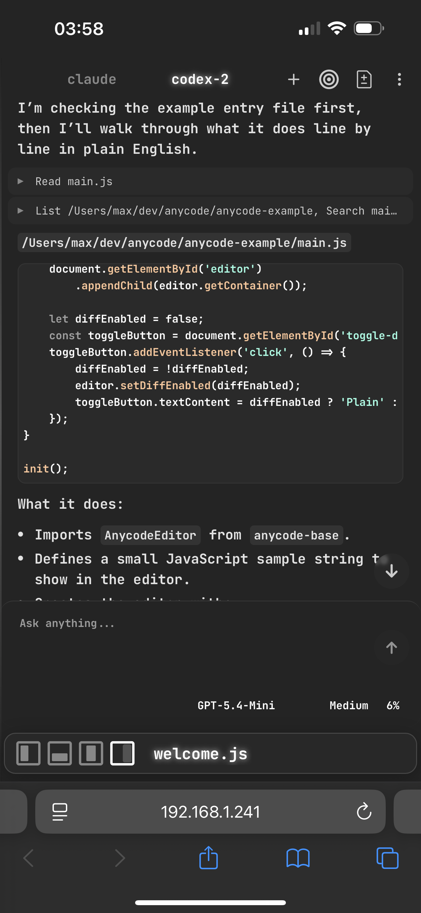
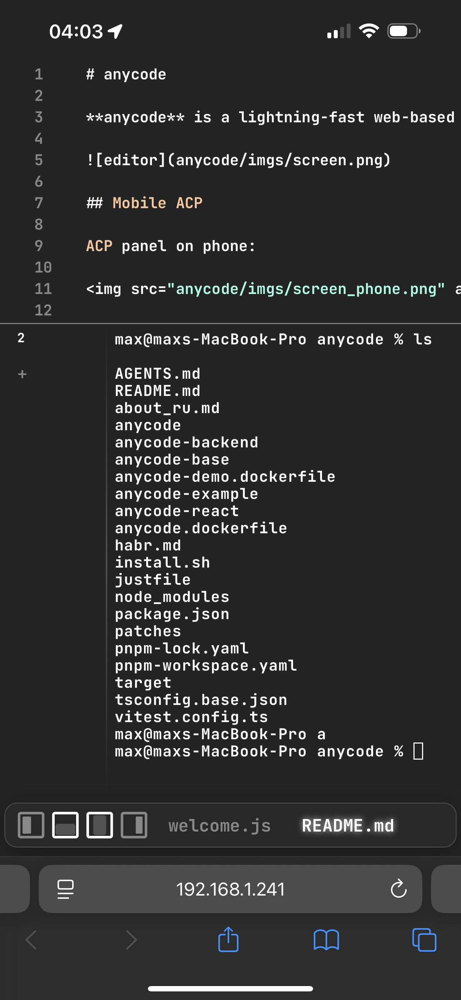

# anycode

**anycode** is a lightning-fast web-based IDE that allows you to write, edit, and manage code directly from your browser. Built for speed and performance, anycode supports a wide range of programming languages and provides an intuitive interface with powerful features for a seamless development experience.






## Mobile Previews

<table style="border-collapse: collapse; border: 0;">
  <tr>
    <td align="center" style="border: 0;">
      <br/>
      Editor
    </td>
    <td align="center" style="border: 0;">
      <br/>
      Agent
    </td>
    <td align="center" style="border: 0;">
      <br/>
      Terminal
    </td>
    <td align="center" style="border: 0;">
      <br/>
      Search
    </td>
  </tr>
</table>


## Features
- **Ultra-fast custom editor**: Exceptionally fast and highly optimized virtual rendering engine based on tree-sitter parser, delivering superior performance for large codebases. 
- **Multi-language support**: Work with various programming languages in a single environment.
- **Advanced code experience**: Utilizes a custom code component based on **web-tree-sitter** for efficient parsing, syntax highlighting, and real-time code analysis.
- **LSP integration**: LSP support for intelligent code completion, go-to-definition, hover information and real-time diagnostics.
- **File system integration**: WebSocket-based backend for browsing and editing files from your local filesystem.
- **Changes**: Built-in git Changes panel, per-file revert, commit, push, and pull.
- **Integrated terminal**: Full-featured terminal emulator with WebSocket-based communication, supporting real-time command execution and output.
- **Search functionality**: Powerful search capabilities including local search within files and global search across project.
- **ACP integration**: Agent Client Protocol (ACP) support for seamless integration with AI agents, including tool-call streaming, history-backed undo, session resume, frontend-controlled permission mode, model and reasoning selectors, streamed markdown and code blocks, markdown file links, and improved tool-call diff display.

## Architecture

The project consists of several packages:

- **`anycode/`** - Main React frontend application
- **`anycode-base/`** - Core editor library with tree-sitter support
- **`anycode-react/`** - React wrapper for the editor
- **`anycode-backend/`** - Rust backend for file system access
- **`anycode-example/`** - Example application demonstrating anycode usage

## Installation
### From releases

One-shot installer:
```bash
curl -fsSL https://raw.githubusercontent.com/anycode-ide/anycode/main/install.sh | sh
```

You can also pin a version:
```bash
curl -fsSL https://raw.githubusercontent.com/anycode-ide/anycode/main/install.sh | sh -s -- --version v0.0.10
```

Linux (x86_64):
```bash
curl -L https://github.com/anycode-ide/anycode/releases/latest/download/anycode-linux-x86_64-musl.tar.gz | tar -xz
sudo mv anycode /usr/local/bin/
sudo chmod +x /usr/local/bin/anycode
anycode
```

Linux (ARM64):
```bash
curl -L https://github.com/anycode-ide/anycode/releases/latest/download/anycode-linux-aarch64-musl.tar.gz | tar -xz
sudo mv anycode /usr/local/bin/
sudo chmod +x /usr/local/bin/anycode
anycode
```

MacOS:
```bash
curl -L https://github.com/anycode-ide/anycode/releases/latest/download/anycode-universal-apple-darwin.tar.gz | tar -xz
sudo mv anycode /usr/local/bin/
sudo chmod +x /usr/local/bin/anycode
anycode
```

## Development

1. **Start frontend:**
   ```bash
   pnpm install
   cd anycode
   pnpm build
   pnpm dev
   ```

2. **Start rust backend:**
   ```bash
   cd anycode-backend
   cargo run --release
   ```

3. **Open your browser** and navigate to the frontend URL

## Contributing

We welcome contributions! Please fork the repository and submit a pull request with your changes. Make sure to follow the existing code style and include relevant tests.
