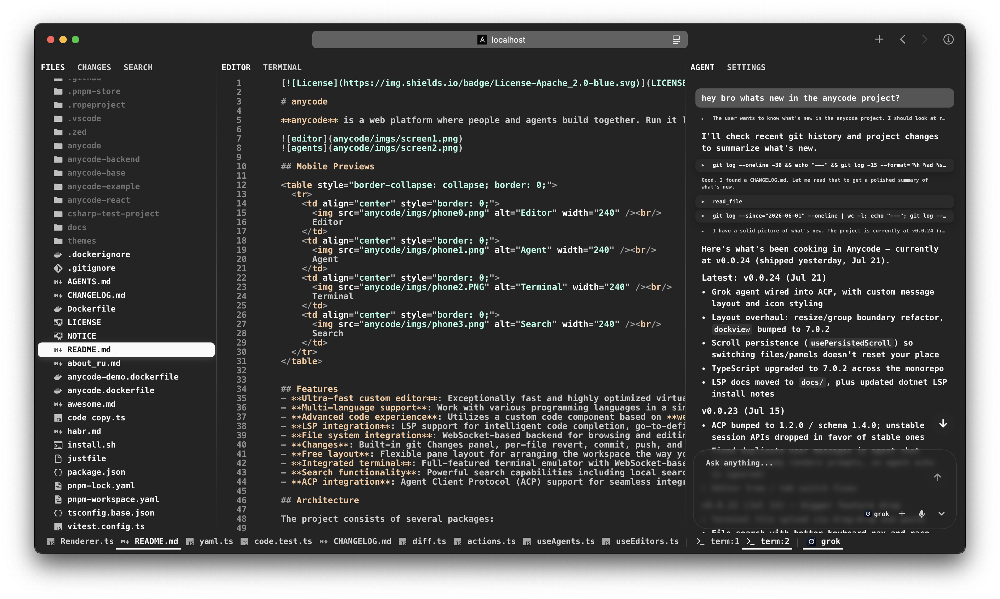
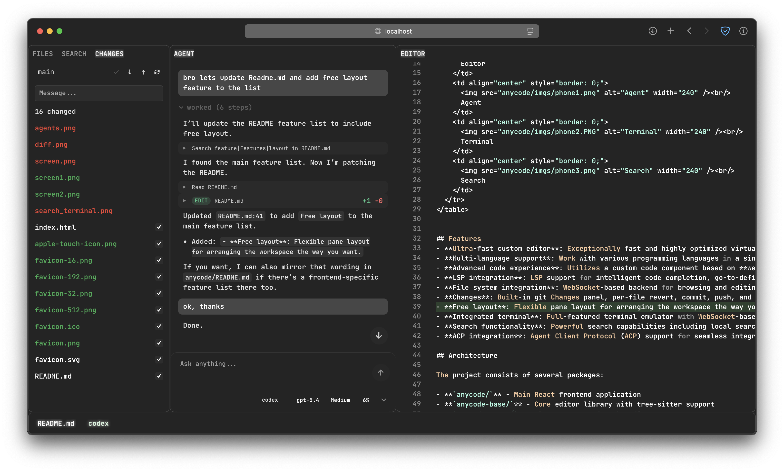
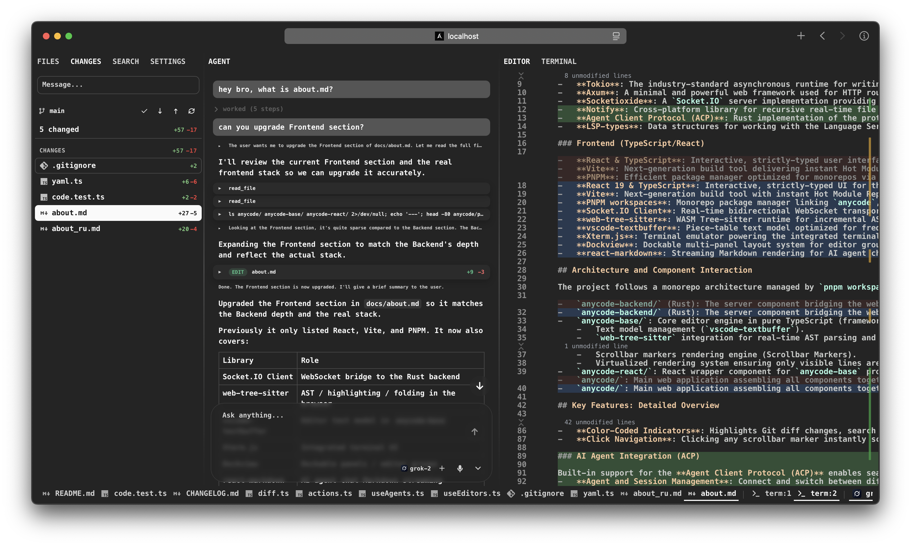

[](LICENSE)

# anycode

**anycode** is a web platform where people and agents build together. Run it locally or remotely and work from any device you want: desktop, laptop, mobile, or even VR. Use any agent, including Codex, Claude Code, OpenCode, as well as local models.





## Features
- **Ultra-fast custom editor**: Exceptionally fast and highly optimized virtual rendering engine based on tree-sitter parser, delivering superior performance for large codebases. 
- **Multi-language support**: Work with various programming languages in a single environment.
- **Advanced code experience**: Utilizes a custom code component based on **web-tree-sitter** for efficient parsing, syntax highlighting, and real-time code analysis.
- **LSP integration**: LSP support for intelligent code completion, go-to-definition, hover information and real-time diagnostics.
- **File system integration**: WebSocket-based backend for browsing and editing files from your local filesystem.
- **Changes**: Built-in git Changes panel, per-file revert, commit, push, and pull with status feedback.
- **History**: Browse Git commit history for the repository or current file, inspect changes, and open previous versions.
- **Free layout**: Flexible pane layout for arranging the workspace the way you want.
- **Integrated terminal**: Full-featured terminal emulator with WebSocket-based communication, supporting real-time command execution and output.
- **Search functionality**: Powerful search capabilities including local search within files and global search across project.
- **ACP integration**: Agent Client Protocol (ACP) support for seamless integration with AI agents, including tool-call streaming, history-backed undo, session resume, frontend-controlled permission mode, model and reasoning selectors, streamed markdown and code blocks, markdown file links, and improved tool-call diff display.

## Architecture

The project consists of several packages:

- **`anycode/`** - Main React frontend application
- **`anycode-base/`** - Core editor library with tree-sitter support
- **`anycode-react/`** - React wrapper for the editor
- **`anycode-backend/`** - Rust backend for file system access
- **`anycode-example/`** - Example application demonstrating anycode usage

## Installation
### From releases

#### macOS and Linux one-shot installer:
```bash
curl -fsSL https://raw.githubusercontent.com/anycode-ade/anycode/main/install.sh | sh
```

#### Windows PowerShell installer (x64):
```powershell
irm https://raw.githubusercontent.com/anycode-ade/anycode/main/install.ps1 | iex
```

Windows installer details:
- Installs `anycode.exe` into `%USERPROFILE%\AppData\Local\anycode\bin` by default
- Adds that directory to the user `PATH` if needed
- Supports overrides via `ANYCODE_VERSION`, `ANYCODE_INSTALL_DIR`, and `ANYCODE_REPO`
- Current release installer targets Windows x64; Windows ARM64 can still build from source


## Development

Prerequisites:
- Node.js 24+
- `pnpm`
- Rust 1.96.0+

1. **Install workspace dependencies:**
   ```bash
   pnpm install
   ```

2. **Start frontend:**
   ```bash
   cd anycode
   pnpm dev
   ```

3. **Build frontend assets for the backend:**
   ```bash
   cd anycode
   pnpm build
   ```

4. **Start Rust backend:**
   ```bash
   cd anycode-backend
   cargo run --release
   ```

5. **Open your browser** and navigate to the frontend URL

## Contributing

We welcome contributions! Please fork the repository and submit a pull request with your changes. Make sure to follow the existing code style and include relevant tests.

## License

**anycode** is licensed under the Apache License, Version 2.0. See [LICENSE](LICENSE) for details.
